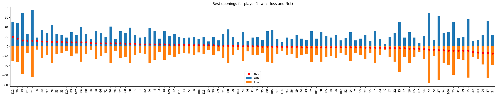

# Project: Build an Adversarial Game Playing Agent

## Synopsis

This project experiments with adversarial search techniques by building an agent to play knights Isolation that moves in L-shaped movements--like a knight in chess.

### Isolation

In the game Isolation, two players each control their own single token and alternate taking turns moving the token from one cell to another on a rectangular grid.  Whenever a token occupies a cell, that cell becomes blocked for the remainder of the game.  An open cell available for a token to move into is called a "liberty".  The first player with no remaining liberties for their token loses the game, and their opponent is declared the winner.

In knights Isolation, tokens can move to any open cell that is 2-rows and 1-column or 2-columns and 1-row away from their current position on the board.  On a blank board, this means that tokens have at most eight liberties surrounding their current location.  Token movement is blocked at the edges of the board (the board does not wrap around the edges), however, tokens can "jump" blocked or occupied spaces (just like a knight in chess).

Finally, agents have a fixed time limit (150 milliseconds by default) to search for the best move and respond.  The search will be automatically cut off after the time limit expires, and the active agent will forfeit the game if it has not chosen a move.

**You can find more information about the Isolation library in the readme [here](/isolation/README.md).**

## Project steps

Step 1: Building the opening book
This book contains openings and in-game moves leading to victory. It is structured as a dictionary with {key : value} pairs as state and recommended next move. We can use our player to call on the opening book and improve win ratio over baseline (random moves).

Our opening book is constructed using 5000 randomized games, each up to 100 turns. We calculate the winning rate (win over loss) over our game samples for the same initial first moves. From there we select all winning sequences (player 0 wins the game) with win rate above 60%. Once we have a set of first moves and the following moves till victory, we retain these sequences to form our opening book using the hash signature of each state as a key.
We repeat this process 10 times to fill up our book. The final opening book contains circa 28.000 moves corresponding to the winning sequences from an initial move with higher than average win rate. The opening book is stored locally in data.pickle file.
The process is detailed in the notebook provided with the project.

fig# 1: Ranking of best openings using win rate based on our sample games

Step 2: Define the get_action() Method. This function is called once per turn for each player. The calling function handles the time limit. 

#### Initialization Data
Your agent will automatically read the contents of a file named `data.pickle` if it exists in the same folder as `my_custom_player.py`. The serialized object from the pickle file will be assigned to `self.data`. Your agent should not write to or modify the contents of the pickle file during search.

### Option 2: Develop an opening book (must span at least depth 4 of the search tree)

- Write your own code to develop an opening book of the best moves for every possible game state from an empty board to at least a depth of 4 plies
- Create a performance baseline using `run_search.py` (with the `fair_matches` flag _disabled_) to evaluate the effectiveness of your agent using randomly chosen opening moves.  (You can use any heuristic function, but you should use the same heuristic on your agent for all experiments.)
- Use the same procedure to evaluate the effectiveness of your agent when early moves are selected from your opening book

**Hints:**
- Developing an opening book can require long run-times to simulate games and accumulate outcome statistics
- If the results are very close, try increasing the number of matches (e.g., >100) to increase your confidence in the results

